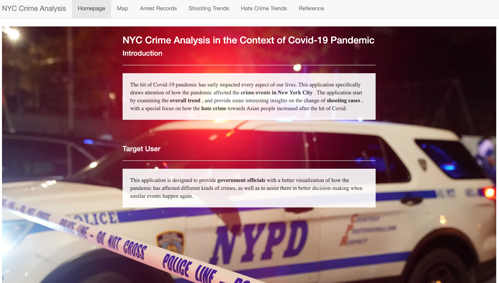

# Project 2: Shiny App Development

### [Project Description](doc/project2_desc.md)



## Project Title The Impact of COVID-19 on NYC Crime Events
Term: Spring 2022

+ Team Group-12
+ **Projec title**: + Team members
	+ Nallamaddi, Shriya sn2956@columbia.edu
	+ Tang, Shiqi st3349@columbia.edu
	+ Wang, Jiuru jw4150@columbia.edu
	+ Yu, Jiaxin jy3161@columbia.edu
	+ Zhang, Nichole qz2446@columbia.edu

+ **Project summary**: 
	+ This application specifically draws attention of how the pandemic affected the crime events in New York City. 
	+ The application start by examining the overall trend, and provide some interesting insights on the change of shooting cases, with a special focus on how the hate crime towards Asian people increased after the hit of Covid.
	+ Link to the app: https://gr5243proj2group12.shinyapps.io/proj2group12/ 

+ **Contribution statement**: ([default](doc/a_note_on_contributions.md)) 
	+ All team members designed the study together.
	+ Shriya Nallamaddi and Jiuru Wang contribute to the ‘Arrest Records’ page.
	+ Shiqi Tang contributes to the ‘’Homepage’, ‘Map’ and ‘Reference’ page.
	+ Jiaxin Yu contributes to the ‘Shooting cases’ page.
	+ Nichole Zhang contributes to the ‘Hate Crime’ page.
	+ All team members helped in debugging and deploying the app.
	+ Jiaxin Yu presents the project.
	+ All team members approve our work presented in this GitHub repository including this contributions statement. 


Following [suggestions](http://nicercode.github.io/blog/2013-04-05-projects/) by [RICH FITZJOHN](http://nicercode.github.io/about/#Team) (@richfitz). This folder is orgarnized as follows.

```
proj/
├── app/
├── lib/
├── data/
├── doc/
└── output/
```

Please see each subfolder for a README file.

